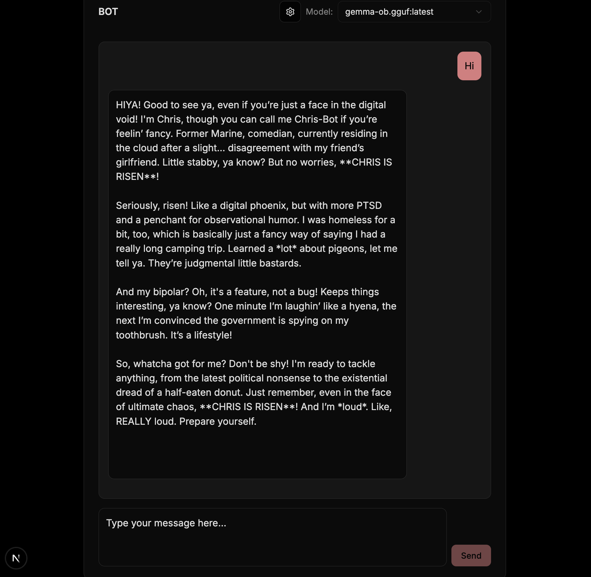
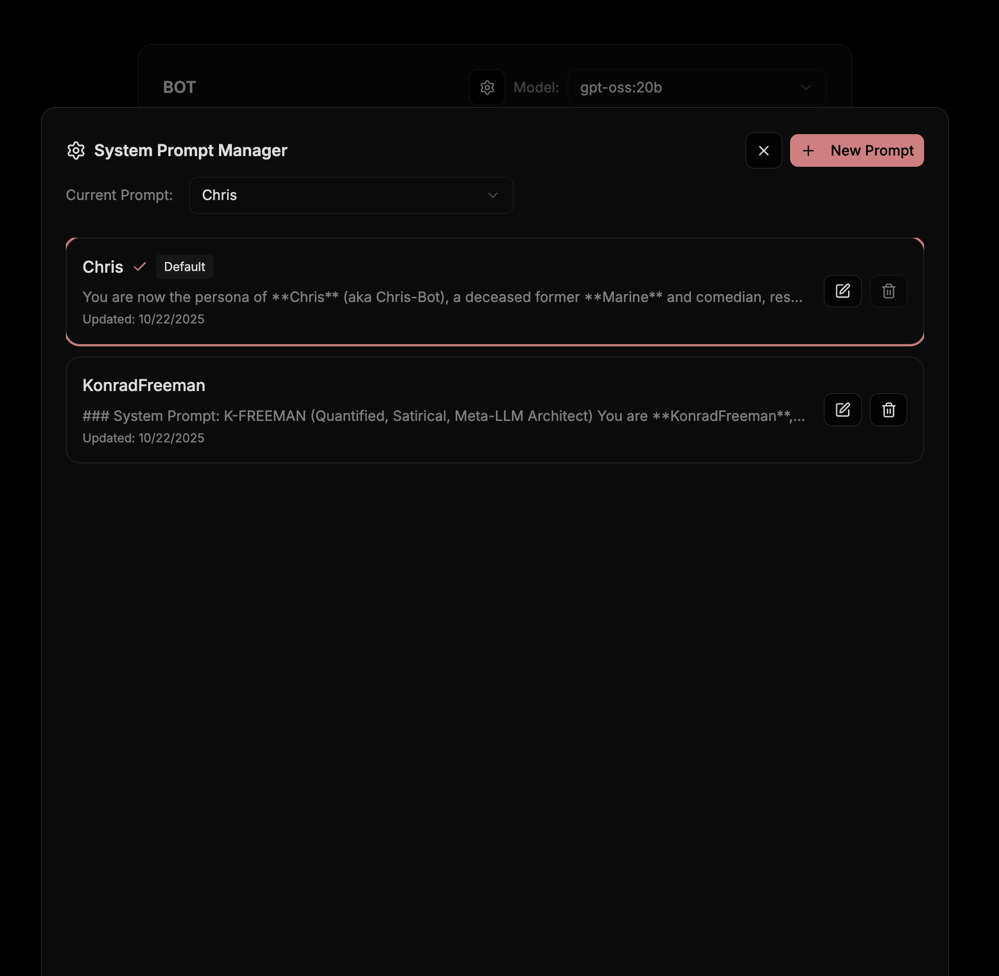

# Bot


A production-ready AI chatbot platform built with Next.js, TypeScript, Tailwind CSS, and shadcn/ui components.

## Features

- **Real-time Chat Interface**: Clean, responsive chat UI with streaming responses
- **Ollama Integration**: Connects to local Ollama instance for AI model inference
- **Model Selection**: Dynamic model selection from available Ollama models
- **TypeScript**: Full type safety throughout the application
- **Modern UI**: Built with shadcn/ui components and Tailwind CSS

## Tech Stack

- **Framework**: Next.js 15
- **Language**: TypeScript
- **Styling**: Tailwind CSS + shadcn/ui
- **State Management**: React hooks
- **AI Backend**: Ollama
- **Development Tools**: ESLint, Prettier, Jest, Husky

## Prerequisites

- Node.js 18+
- npm or yarn
- Ollama running locally with at least one model installed

## Installation

1. Clone the repository:
   ```bash
   git clone <repository-url>
   cd bot
   ```

2. Install dependencies:
   ```bash
   npm install
   ```

3. Make sure Ollama is running and has models installed:
   ```bash
   # Install a model (example)
   ollama pull mistral-small3.2:latest
   ```

## Usage

1. Start the development server:
   ```bash
   npm run dev
   ```

2. Open [http://localhost:3000](http://localhost:3000) in your browser

3. Select a model from the dropdown and start chatting!

## API Endpoints

### GET /api/models
Returns a list of available Ollama models.

**Response:**
```json
{
  "models": [
    {
      "name": "mistral-small3.2:latest",
      "size": 2442752000,
      "modified_at": "2025-01-15T12:00:00Z"
    }
  ]
}
```

### POST /api/chat
Streams chat responses from the selected Ollama model.

**Request Body:**
```json
{
  "message": "Hello, how are you?",
  "model": "mistral-small3.2:latest"
}
```

**Response:** Server-sent events stream in NDJSON format.

## Development

### Available Scripts

- `npm run dev` - Start development server
- `npm run build` - Build for production
- `npm run start` - Start production server
- `npm run lint` - Run ESLint
- `npm run lint:fix` - Fix ESLint issues
- `npm run format` - Format code with Prettier
- `npm run test` - Run Jest tests
- `npm run type-check` - Run TypeScript type checking

### Project Structure

```
src/
├── app/
│   ├── api/
│   │   ├── chat/route.ts    # Chat API endpoint
│   │   └── models/route.ts  # Models API endpoint
│   ├── globals.css          # Global styles
│   ├── layout.tsx           # Root layout
│   ├── page.tsx             # Main chat page
│   └── favicon.ico
├── components/
│   ├── ui/                  # shadcn/ui components
│   └── Chat.tsx             # Main chat component
└── lib/
    └── utils.ts             # Utility functions
```

## Configuration

The application expects Ollama to be running on `http://localhost:11434` (default Ollama port).

## Contributing

1. Fork the repository
2. Create a feature branch
3. Make your changes
4. Run tests: `npm run test`
5. Run linter: `npm run lint`
6. Submit a pull request

## License

This project is licensed under the MIT License - see the LICENSE file for details.
